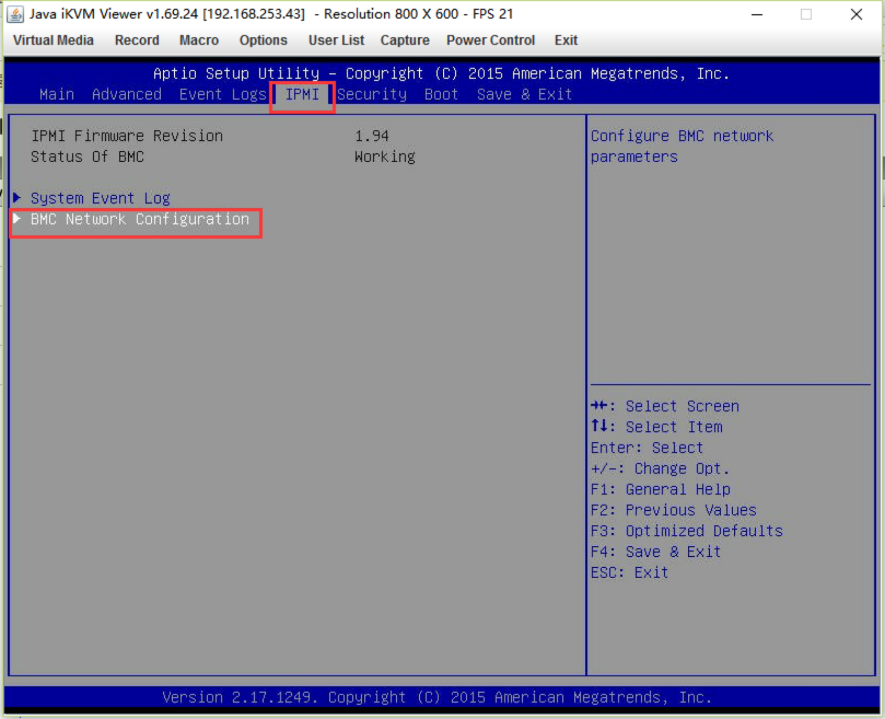
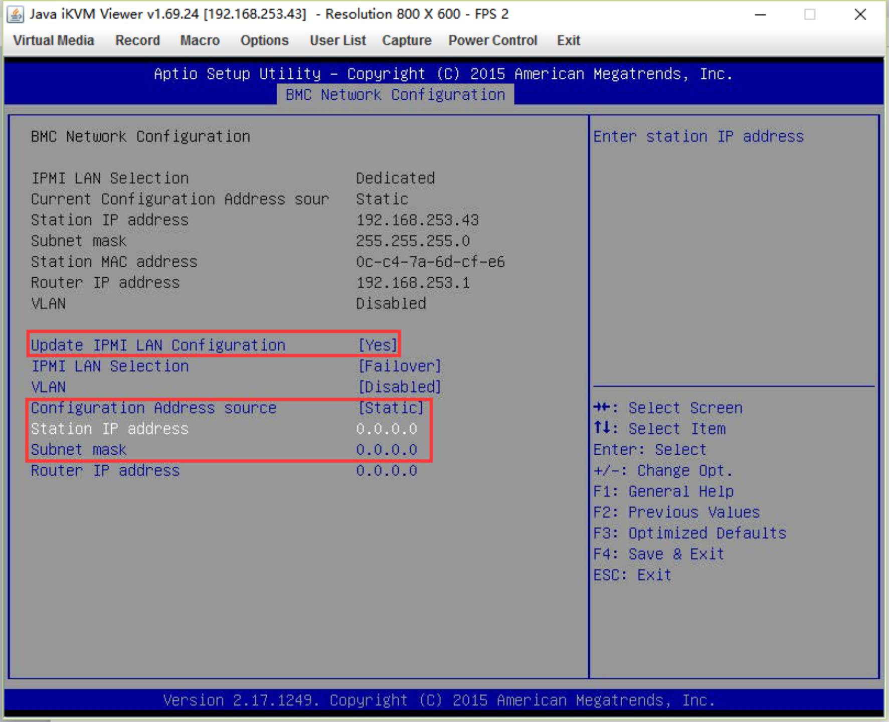
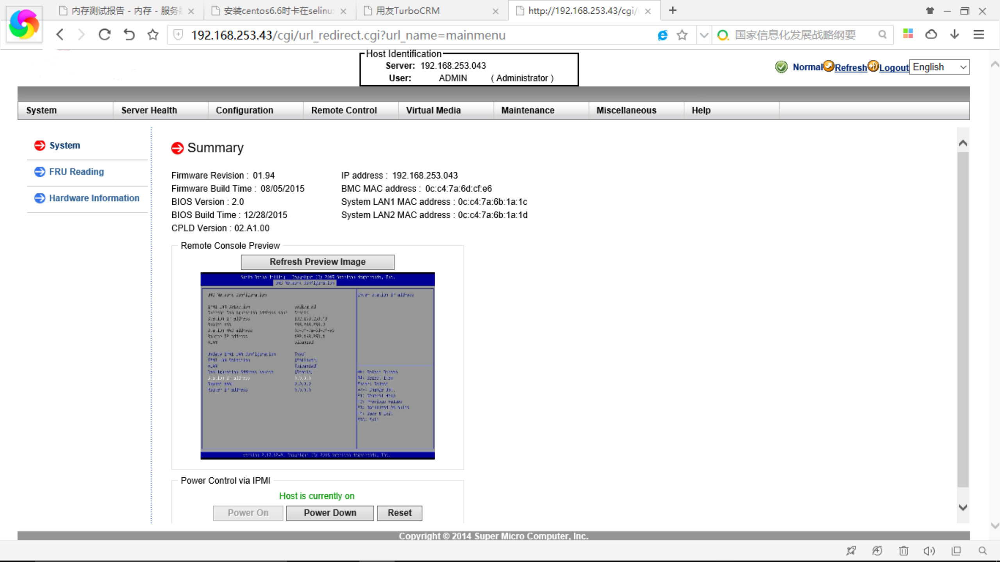
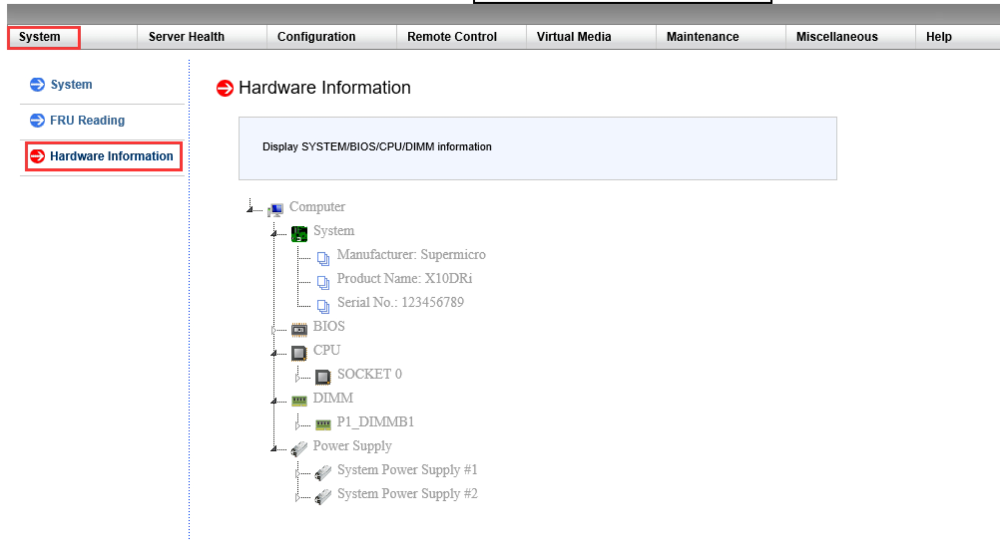
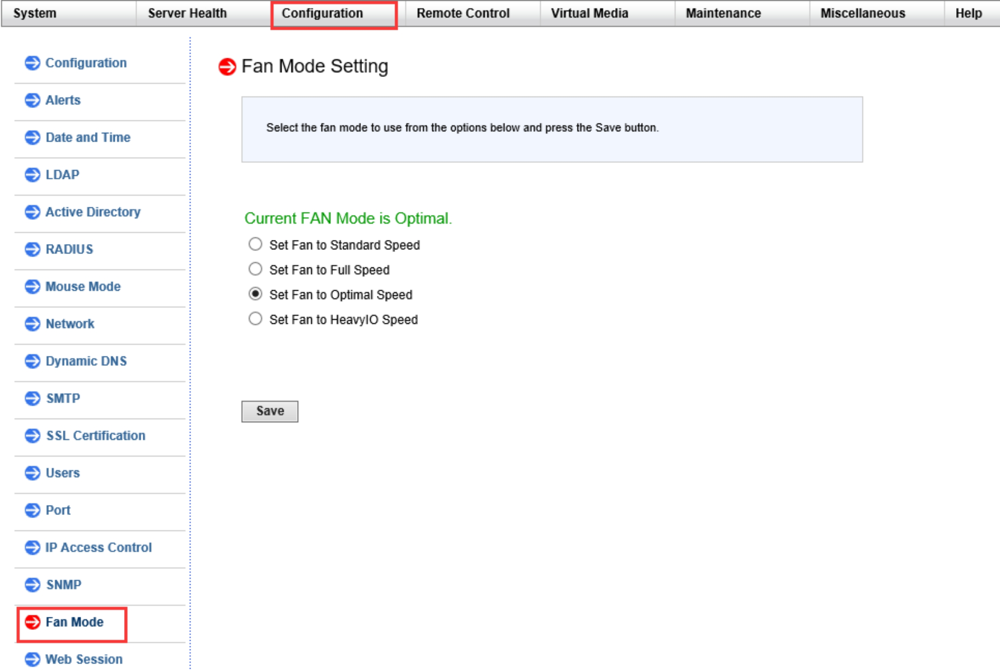
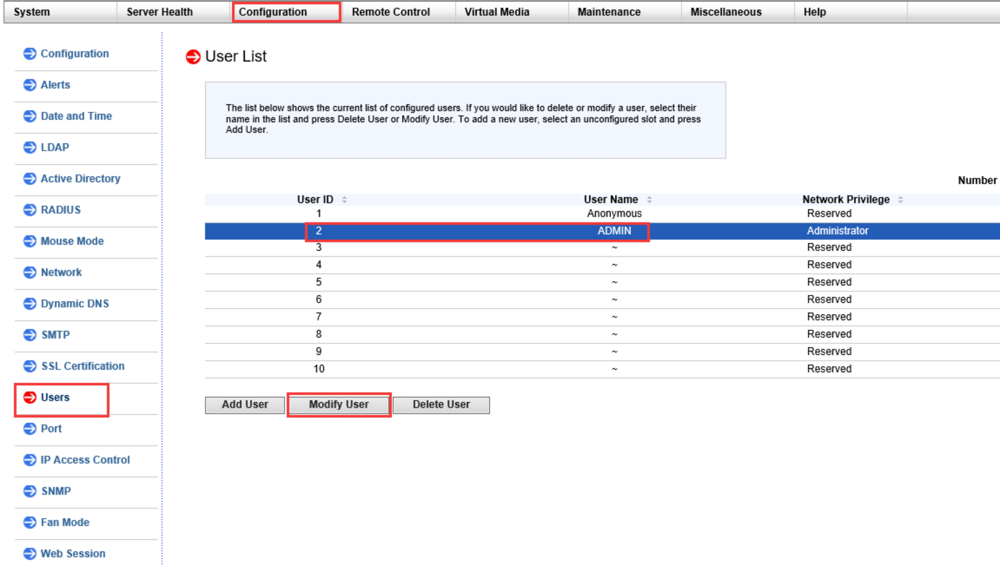
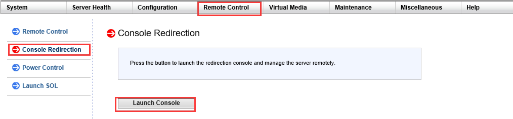
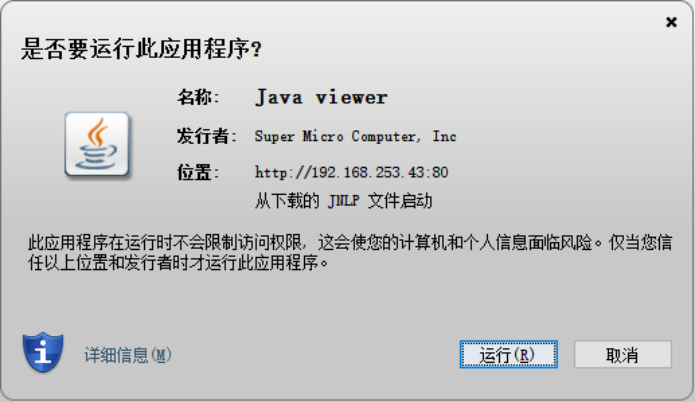
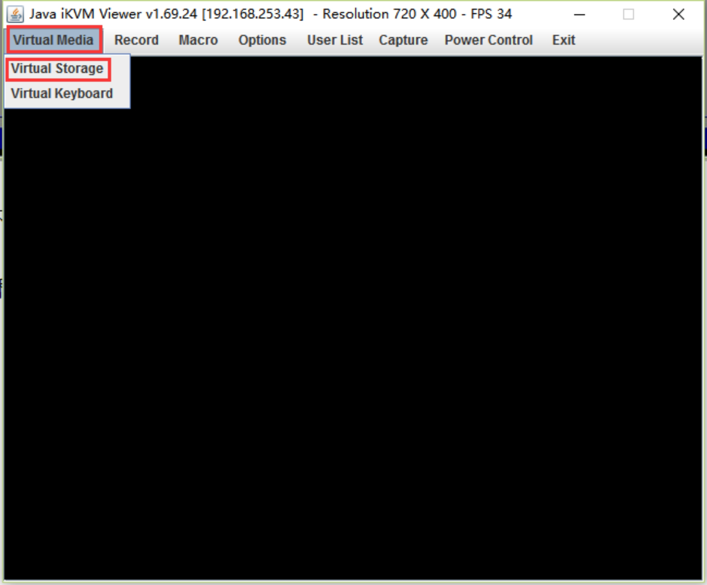
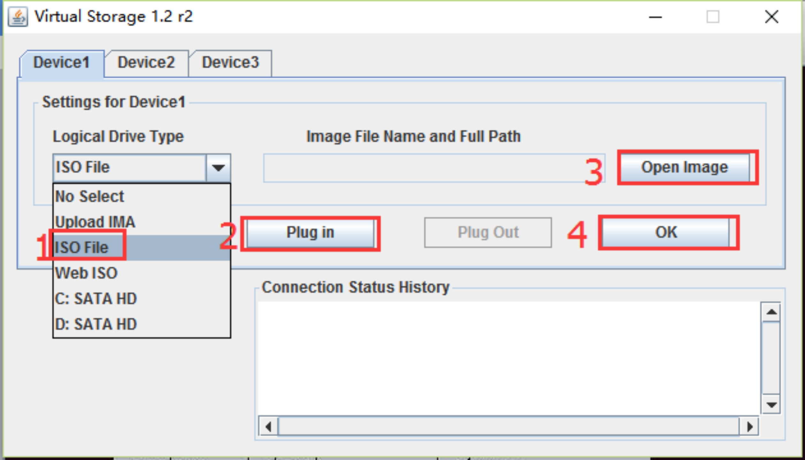

# IPMI

## 准备：设备IPMI口链接到交换机

## 操作

### 1、设置IPMI地址

### 2、WEB登录IPMI管理页面

### 3、查看硬件信息

### 4、查看风扇转速

### 5、修改登陆的用户名及密码

### 6、远程控制服务器

> 点击后会从服务器上下载一个JAVA启动工具（jnlp文件)，要求有JRE环境，JRE8即可（不支持M1芯片）

### 7、远程IPMI安装操作系统

> 插入虚拟U盘，选择相应的操作系统ISO文件，在BIOS启动项中开启从虚拟U盘启动的选项，保存重启进入系统安装界面
