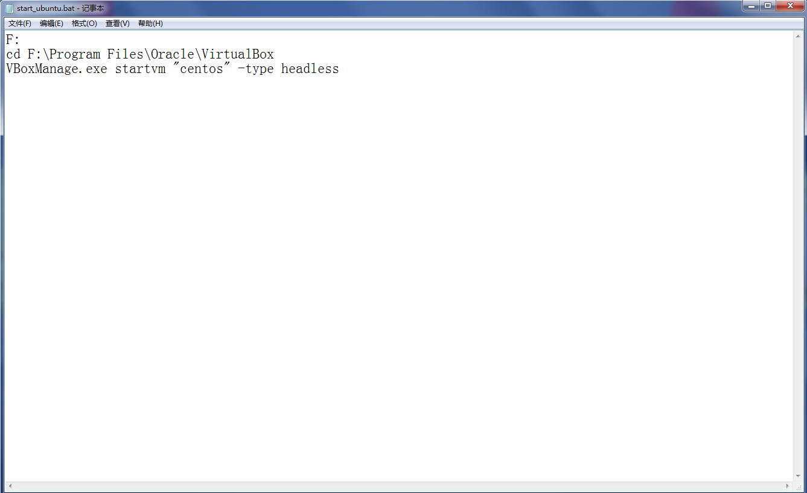
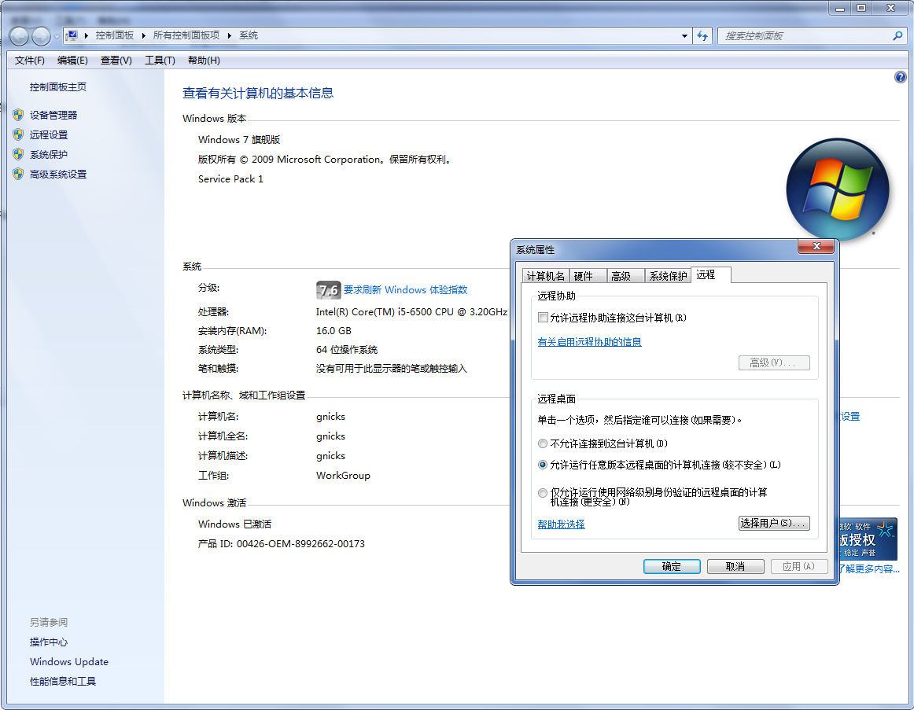
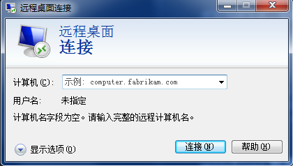

# windows使用

## 后台virtualbox一键启动虚拟机

桌面创建文本，复制以下内容，保存成.bat文件

```shell
# 切磁盘到安装virtualbox所在盘
F:
# 进入目录
cd F:\Program Files\Oracle\VirtualBox
# 无窗口启动虚拟机，冒号里是虚拟机的名称
VBoxManage.exe startvm "centos" -type headless
```



## windows系统远程连接

1. 被远程设备 我的电脑/计算机-》属性—》远程设置-》勾选打开允许远程

    

1. 远程电脑 win+r-》输入mstsc-》输入ip（有密码的输入账户名和密码）

    
